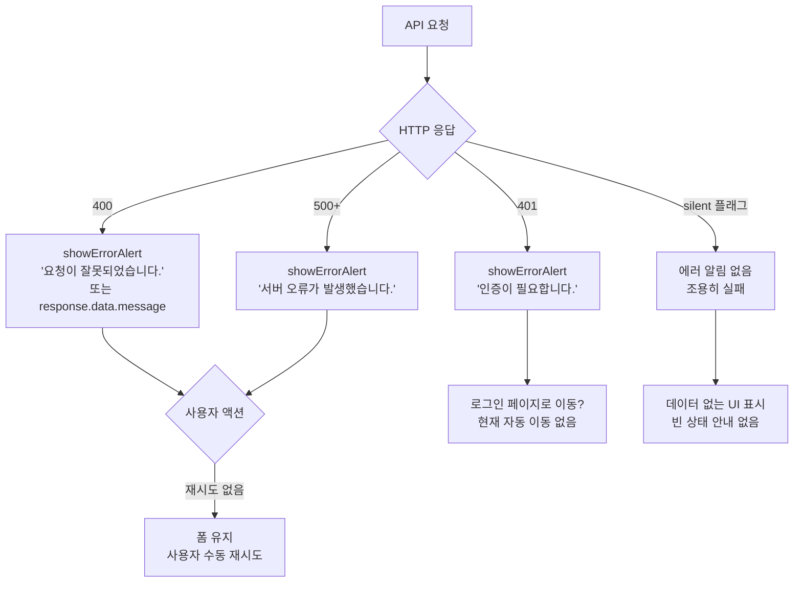

# Seoul CHONNOM (서울촌놈) — 정보구조도(IA) & UI/UX 진단 리포트

> 작성일: 2026-02-26
> 분석 대상: `slcnfront` (Vue 3 / Pinia / Vue Router 4)
> 목적: UI/UX 전면 개편을 위한 현황 진단 및 개선 우선순위 도출
> **v2 업데이트**: 실제 화면 스크린샷(13장) 분석을 반영하여 "확인 불가" 항목 갱신 및 시각적 문제 추가

---

## 목차

1. [산출물 1: 정보구조도(IA)](#1-산출물-1-정보구조도ia)
   - [A. 사이트맵 (계층 트리)](#a-사이트맵-계층-트리)
   - [B. 화면별 요약 카드](#b-화면별-요약-카드)
   - [C. 사용자 플로우](#c-사용자-플로우)
2. [산출물 2: UI/UX 진단 리포트](#2-산출물-2-uiux-진단-리포트)
   - [A. IA 관점 문제 후보](#a-ia-관점-문제-후보)
   - [B. 화면 상태 UX 품질 점검 체크리스트](#b-화면-상태-ux-품질-점검-체크리스트)
   - [C. 개선 우선순위 Top 10](#c-개선-우선순위-top-10)

---

## 1. 산출물 1: 정보구조도(IA)

### A. 사이트맵 (계층 트리)

```
/ (root — 인증 가드: admin 역할 필요)
│
├── /login                         ← 공개 접근 가능 (유일한 비인증 라우트)
│
├── / (메인 대시보드)
│   ├── D-day 카드                  ← 기념일 계산 (하드코딩: 2024-11-10)
│   ├── 달력 네비게이션 카드         ← /calendar 진입점
│   ├── 나들이 기록 네비게이션 카드   ← /map 진입점
│   ├── 신발 추천 네비게이션 카드     ← /shoesRecom 진입점
│   └── 최필름아트 카드             ← 외부 링크 (Naver 드라이브)
│
├── /map (나들이 기록 목록)
│   ├── 나들이 카드 목록             ← 퀴즈 통과 후 상세 진입
│   │   └── /map/:date (나들이 상세)  ← 동적 라우트
│   └── 새 나들이 기록하기 버튼
│       └── /map/register (나들이 등록)
│
├── /calendar (일정 관리)
│   └── TOAST UI Calendar           ← 달력 CRUD (인라인 폼 팝업)
│
└── /shoesRecom (신발 추천 목록)
    └── /:brand/:shoesName (신발 상세)  ← 동적 중첩 라우트
        └── [뉴발란스 NB574, NB530]
            [나이키 P-6000, V2K런, 줌보메로5]
            [아식스 조그100]
```

**주요 특성**
- 총 라우트: 8개 (공개 1, 인증 7)
- 동적 라우트: `/map/:date`, `/:brand/:shoesName` — 2개
- 레이아웃 분리: `/login`은 `login-page-body` 클래스, 나머지는 공통 프레임 (`App.vue` 헤더/푸터 포함)
- 리다이렉트: 인증 실패 → `/login`, 인증 성공 → `/` (명시적 리다이렉트 없음, 가드에서 처리)

---

### B. 화면별 요약 카드

#### SCR-01 · `/login` — 로그인

| 항목 | 내용 |
|------|------|
| **사용자 목적** | 아이디/비밀번호로 로그인하여 서비스에 접근한다 |
| **주요 콘텐츠** | SLCN 로고, "SLCN Login" 제목, 아이디/비밀번호 입력 폼, Login 버튼, 하단 copyright |
| **주요 액션(CTA)** | Login 버튼(파란색) → 인증 성공 시 `/` 이동 |
| **필요 데이터** | `POST /user/login`, `GET /user/token` (리프레시, silent) |
| **상태 처리** | 빈칸 검증 → `showErrorAlert()` / API 오류 → `showErrorAlert()` / 리프레시 실패 → silent |
| **시각적 특성** | 연분홍 배경 + 흰 카드 중앙 정렬. 데스크톱 기준 약 460px 너비 카드. 모바일 미검증 |
| **접근성/반응형** | ⚠️ placeholder가 영어("Enter your id", "Enter your password") — 서비스 언어(한국어)와 불일치. 라벨("아이디", "비밀번호")이 `<label>` 태그가 아닌 텍스트로만 표시되어 스크린리더 연결 불명확 |
| **기타 문제** | 회원가입/비밀번호 찾기 링크 없음 (폐쇄형 서비스 의도로 보임) |

---

#### SCR-02 · `/` — 메인 대시보드

| 항목 | 내용 |
|------|------|
| **사용자 목적** | 서비스의 주요 기능으로 빠르게 진입한다 |
| **주요 콘텐츠** | 상단 SLCN 로고, 3행 카드 그리드: [만난지 474일째 / calendar] → [map] → [Choi's Film Art / recom] |
| **주요 액션(CTA)** | 각 카드 클릭 → 해당 기능 페이지 이동 / D-day 카드 클릭 → SweetAlert 팝업 |
| **필요 데이터** | 없음 (자식 컴포넌트가 독립적으로 처리) |
| **상태 처리** | 없음 — 로딩/에러/빈 상태 처리 부재 |
| **시각적 특성** | 모든 카드가 동일한 연분홍 색상, 동일한 크기/형태로 배치. 카드 내부에 아이콘·이미지·설명 없이 텍스트 라벨만 존재 |
| **접근성/반응형** | ⚠️ 카드 라벨이 영어("calendar", "map", "recom")로 표기 — 한국 사용자 직관성 부족. 카드 내부 콘텐츠 부재로 기능 파악이 어려움. 5개 카드가 시각적 위계 없이 동등 배치 |

---

#### SCR-03 · `/map` — 나들이 기록 목록

| 항목 | 내용 |
|------|------|
| **사용자 목적** | 저장된 나들이 목록을 확인하고 상세 페이지로 진입한다 |
| **주요 콘텐츠** | "서울 촌놈 나들이 기록 📸" 타이틀, 나들이 카드 리스트(로고 이미지 + 날짜 + 이름), 하단 문구 |
| **주요 액션(CTA)** | 나들이 카드 클릭 → 퀴즈 팝업(4지선다) → 정답 시 `/map/:date` 이동 / 오답 시 목록 잔류 |
| **필요 데이터** | `GET /trip` → `tripStore.tripList` / `GET /depot?path=` (로고 Blob 이미지) |
| **상태 처리** | 로딩 처리 없음. 에러 처리 없음 (silent 실패). 빈 상태 처리 없음 |
| **시각적 특성** | 카드별 좌측 손글씨 스타일 로고 이미지, 우측 날짜(YYYY.MM.DD) + 나들이 이름. "새 나들이 기록하기" 버튼은 스크롤 최하단에 위치 — 스크린샷에 노출 안 됨 |
| **퀴즈 팝업 UX** | 문제: "?" 아이콘 + 질문 + 라디오 4지선다 + OK 버튼 / 정답: 초록 체크 + 메시지 / 오답: 주황 X + 위로 메시지. 퀴즈 오답 시 닫기 버튼 없이 자동 닫힘 |
| **접근성/반응형** | ⚠️ 퀴즈 라디오 버튼에 키보드 접근 가능 여부 미확인. 카드 클릭 영역 명확성 불명확 |

---

#### SCR-04 · `/map/register` — 나들이 등록

| 항목 | 내용 |
|------|------|
| **사용자 목적** | 새로운 나들이 기록(지도, 퀴즈, 드라이브 링크)을 등록한다 |
| **주요 콘텐츠** | "서울 촌놈 나들이 추가" 타이틀, 15개+ 입력 필드(유형·날짜·로고·이름·지도·드라이브링크·퀴즈 전체), 저장 버튼 |
| **주요 액션(CTA)** | 저장 버튼(파란색) → `POST /trip` (multipart/form-data) → 성공 시 `/map` 이동 |
| **필요 데이터** | `POST /trip`, 파일 검증(`validateFile`), 폼 검증(`validateForm`) |
| **상태 처리** | 폼 검증 후 `showErrorAlert()` / 파일 검증 실패 시 경고 / 성공 시 `showSuccessAlert()` |
| **시각적 특성** | 라벨-인풋 행 방식의 단일 긴 폼. 섹션 구분선·그룹 헤더 없음. 필수 필드 표시(`*`) 없음. "정답1~4" 라벨이 실제로는 선택지(보기)인데 "정답"으로 표기되어 혼란 야기. "정답 번호" 필드는 텍스트 입력으로 사용자가 직접 숫자를 입력해야 함 |
| **접근성/반응형** | ⚠️ 15개 필드를 스크롤 없이 파악 불가. 퀴즈 섹션과 기본정보 섹션의 시각적 구분 없음. "2번 지도 추가하기" 토글 버튼의 기능 설명 부족 |

---

#### SCR-05 · `/map/:date` — 나들이 상세

| 항목 | 내용 |
|------|------|
| **사용자 목적** | 특정 날짜의 나들이 지도와 드라이브 링크를 본다 |
| **주요 콘텐츠** | "서울 촌놈 나들이 경로 😎" 타이틀, 지도 이미지(세로형, 스크롤), 드라이브 링크 버튼(아이콘+텍스트) |
| **주요 액션(CTA)** | 복수 지도 시 지도 전환 버튼(하단), 드라이브 링크 열기 |
| **필요 데이터** | `GET /trip/:date` → `tripStore.findTripInfo()` (캐시) / `GET /depot?path=` (지도 Blob) |
| **상태 처리** | 없음 — 로딩 중 지도 이미지 없는 상태 처리 부재 |
| **시각적 특성** | 단일 지도: 지도 이미지 + 하단 드라이브 버튼만 존재. 복수 지도: 하단에 지도 전환 버튼 추가(예: "파주 경로 공급하다온!") — 현재 몇 번째 지도인지 인디케이터(1/2) 없음 |
| **접근성/반응형** | ⚠️ 뒤로가기 버튼 없음(확인됨). 지도 이미지에 alt 텍스트 없음. 지도 전환 버튼 텍스트가 커스텀 텍스트라 기능 파악 어려울 수 있음 |

---

#### SCR-06 · `/calendar` — 일정 관리

| 항목 | 내용 |
|------|------|
| **사용자 목적** | 월간 달력에서 일정을 생성·수정·삭제한다 |
| **주요 콘텐츠** | "서울촌놈 나들이 일정 📅" 타이틀, TOAST UI Calendar 월간 뷰, 연월 표시(좌), Today/</>  버튼(우) |
| **주요 액션(CTA)** | 날짜 클릭 → 일정 생성 팝업 / 이벤트 클릭 → 상세/수정/삭제 팝업 |
| **필요 데이터** | `GET /schedule` (초기), `GET /schedule/date?year=&month=` (달 이동 시) / CRUD API |
| **상태 처리** | 등록 실패 시 `swal.fire(error.message)`. 로딩/빈 상태 처리 없음 |
| **시각적 특성** | 오늘 날짜 파란 원 강조. 요일 영어 표기(Sun~Sat). 일정 없을 때 빈 달력만 표시 — empty state 문구 없음. 달력 배경이 흰색이라 연분홍 전체 페이지 배경과 어울리지 않음 |
| **접근성/반응형** | TOAST UI 자체 UI 의존. 한국어 서비스임에도 달력 요일이 영어로 표기. 커스텀 접근성 처리 없음 |

---

#### SCR-07 · `/shoesRecom` — 신발 추천 목록

| 항목 | 내용 |
|------|------|
| **사용자 목적** | 브랜드별 신발 카탈로그를 보고 관심 신발을 선택한다 |
| **주요 콘텐츠** | "서울 촌놈의 신발 추천 👟" 타이틀, 브랜드 로고(NB/Nike/ASICS) + 브랜드 설명 + 신발 이미지/이름/가격 목록, 하단 안내 문구 |
| **주요 액션(CTA)** | 신발 클릭 → `/:brand/:shoesName` 이동 |
| **필요 데이터** | `global.js` 정적 데이터 (API 없음) |
| **상태 처리** | 없음 — 정적 데이터이므로 로딩/에러 불필요 |
| **시각적 특성** | 세로 스크롤 리스트. 신발 이미지 크기 불일치. 브랜드 구분은 로고 + 설명으로 처리됨. 호버/클릭 피드백 불명확 (정적 이미지). 가격 표시 있음(149,000원 등). 6개 신발(NB 2, Nike 3, ASICS 1) |
| **접근성/반응형** | ⚠️ 신발 이미지에 alt 텍스트 미확인. 클릭 가능 요소임을 나타내는 시각적 단서(화살표, 커서 변경 등) 불명확 |

---

#### SCR-08 · `/:brand/:shoesName` — 신발 상세

| 항목 | 내용 |
|------|------|
| **사용자 목적** | 선택한 신발의 상세 정보(설명, 리뷰, 영상)를 확인한다 |
| **주요 콘텐츠** | "서울 촌놈의 신발 추천 👟" 타이틀, 신발 대형 이미지, 신발명+설명 텍스트, 유튜브 임베드(있을 경우), "어리 착용 샷" 섹션(리뷰 이미지 2개+설명) |
| **주요 액션(CTA)** | 리뷰 인스타그램 링크 열기(`windowOpen`), 유튜브 영상 재생(영상 있는 신발) |
| **필요 데이터** | `global.js` 정적 데이터 |
| **상태 처리** | 없음 — 잘못된 brand/shoesName 파라미터 진입 시 처리 없음 |
| **시각적 특성** | **영상 없음(NB530)**: 이미지 → 설명 → 리뷰 착용샷 2개. **영상 있음(V2K런)**: 이미지 → 설명 → 유튜브 임베드 → 리뷰 착용샷. 두 케이스 모두 뒤로가기/목록으로 버튼 없음(확인됨). 리뷰 이미지 설명 텍스트가 비격식체("모씨서 인스타에도 올링...") |
| **접근성/반응형** | ⚠️ 뒤로가기 버튼 없음(확인됨). 신발 이미지/리뷰 이미지 alt 텍스트 미확인. 유튜브 임베드의 키보드 접근 가능하나 커스텀 컨트롤 없음 |

---

### C. 사용자 플로우

#### 플로우 1 — 비로그인 → 로그인 → 메인 진입

```mermaid
flowchart TD
    A([앱 진입]) --> B{인증 가드\n토큰 있음?}
    B -- 없음 --> C[/login 페이지]
    B -- 있음 --> H[/ 메인 대시보드]

    C --> D[아이디/비밀번호 입력]
    D --> E{빈칸 검증}
    E -- 실패 --> F[showErrorAlert]
    F --> D
    E -- 통과 --> G[POST /user/login]
    G -- 성공 --> H
    G -- 실패 --> F

    H --> I{리프레시 토큰 시도\nonMounted}
    I -- 성공 --> J[토큰 갱신]
    I -- 실패 --> K[silent 무시]
```

---

#### 플로우 2 — 나들이 목록 → 퀴즈 → 상세 지도 보기

```mermaid
flowchart TD
    A[/ 메인] --> B[mapComponent 클릭]
    B --> C[/map 나들이 목록]
    C --> D[GET /trip → 카드 렌더링]
    D --> E[나들이 카드 클릭]
    E --> F[showRadioAlert 퀴즈 팝업\n4지선다]
    F -- 정답 --> G[showSuccessAlert]
    G --> H[/map/:date 나들이 상세]
    H --> I[GET /trip/:date\n+ GET /depot?path=]
    I --> J[지도 이미지 표시]
    J --> K{multiMap?}
    K -- 예 --> L[지도 전환 버튼 표시]
    K -- 아니오 --> M[단일 지도]
    F -- 오답 --> N[showErrorAlert]
    N --> C
```

---

#### 플로우 3 — 달력 일정 CRUD

```mermaid
flowchart TD
    A[/calendar 진입] --> B[GET /schedule → 초기 이벤트 로드]
    B --> C[TOAST UI Calendar 렌더링]

    C --> D{사용자 액션}
    D -- 날짜 클릭 --> E[beforeCreateEvent 팝업]
    E --> F[POST /schedule/register]
    F --> G[calendar.createEvents]

    D -- 이벤트 클릭/수정 --> H[beforeUpdateEvent 팝업]
    H --> I[PUT /schedule/modify]
    I --> J[calendar.updateEvent]

    D -- 이벤트 삭제 --> K[beforeDeleteEvent]
    K --> L[PUT /schedule/remove/:id]
    L --> M[calendar.deleteEvent]

    D -- 달 이동 --> N[moveMonth 호출]
    N --> O[GET /schedule/date?year=&month=]
    O --> P[calendar.createEvents 새 이벤트]
```

---

#### 플로우 4 — 나들이 등록 (관리자)

```mermaid
flowchart TD
    A[/map] --> B[새 나들이 기록하기 클릭]
    B --> C[/map/register]
    C --> D[폼 작성\n날짜/이름/파일업로드/퀴즈]
    D --> E{multiMap 필요?}
    E -- 예 --> F[toggleMultiMap 활성화\nbutton1, button2, map2 입력]
    E -- 아니오 --> G[map1만 입력]
    F --> H[등록 버튼]
    G --> H
    H --> I{validateForm\n+ validateFile}
    I -- 실패 --> J[showErrorAlert]
    J --> D
    I -- 통과 --> K[POST /trip multipart/form-data]
    K -- 성공 --> L[showSuccessAlert → /map]
    K -- 실패 --> M[showErrorAlert]
    M --> D
```

---

#### 플로우 5 — 에러 발생 → 처리 경로



---

## 2. 산출물 2: UI/UX 진단 리포트

### A. IA 관점 문제 후보

#### 1. 라우트 충돌 위험 — `/map/register` vs `/map/:date`

- **문제**: `/map/register`와 `/map/:date` 두 라우트가 공존한다. Vue Router는 정의 순서에 따라 매칭하므로 순서가 잘못되면 `register`를 `:date` 파라미터로 해석할 수 있다.
- **근거**: `src/router/index.js` — `mapRegisterPage`와 `tripPage` 라우트 정의 순서 요주의
- **심각도**: 높음

#### 2. 인증 역할 체계의 경직성

- **문제**: 모든 인증 라우트가 `auth: 'admin'` 단 하나의 역할만 요구한다. 일반 사용자 역할(user, guest 등)이 없어 역할 기반 접근 제어(RBAC) 확장이 불가능하다.
- **근거**: `src/router/index.js` — 모든 보호 라우트에 `meta: { auth: 'admin' }`
- **심각도**: 중간

#### 3. 퀴즈 장벽 — 나들이 상세 진입 마찰

- **문제**: `/map` → `/map/:date` 진입에 반드시 퀴즈를 통과해야 한다. 이는 콘텐츠 접근을 게임화한 의도적 설계이나, UX 관점에서 사용자가 목표 콘텐츠에 도달하기 전에 예상치 못한 장벽을 만난다.
- **근거**: `src/components/trip/tripList.vue` — `onClickMap()` → `showRadioAlert()` → 정답 시만 라우팅
- **심각도**: 중간 (의도된 기능이나 오답 시 피드백 UX 개선 필요)

#### 4. 신발 추천 라우트 네이밍 불일치

- **문제**: 라우트명은 `shoesRecom`, `shoesInfo`이고 경로는 `/shoesRecom`, `/:brand/:shoesName`이다. `:brand/:shoesName`이 루트 레벨에 있어 다른 경로와 충돌 가능성이 있고, 신발 관련 경로가 `/shoes/` 접두어로 그룹화되지 않았다.
- **근거**: `src/router/index.js`
- **심각도**: 중간

#### 5. 네비게이션 뎁스 및 복귀 경로 부재

- **문제**: 나들이 상세(`/map/:date`) 진입 후 목록으로 돌아가는 명시적 "뒤로 가기" 버튼이나 브레드크럼이 없다. 브라우저 뒤로 가기에만 의존한다.
- **근거**: `src/views/tripPage.vue` — 네비게이션 컨트롤 없음 (확인 불가, 코드상 근거 없음)
- **심각도**: 중간

#### 6. 단일 진입점(로그인) — 회원가입/비밀번호 찾기 없음

- **문제**: 로그인 페이지에 회원가입, 비밀번호 찾기 등 보조 경로가 없다. 폐쇄형 서비스라면 의도적 설계이나 사용자에게 안내가 없다.
- **근거**: `src/views/loginPage.vue`
- **심각도**: 낮음 (폐쇄형 서비스 의도로 보임)

#### 7. 메인 대시보드의 정보 우선순위 불명확

- **문제**: 메인 페이지에 D-day, 달력, 나들이, 신발추천, 외부링크가 동일한 시각적 비중으로 나열된다. 핵심 기능(나들이, 달력)과 부가 기능(외부링크, D-day)의 위계가 없다.
- **근거**: `src/views/mainPage.vue` — 모든 카드가 동일한 스타일로 배치
- **심각도**: 중간

---

### B. 화면 상태 UX 품질 점검 체크리스트

> 📸 = 스크린샷으로 시각 확인 / 💻 = 코드 분석으로 확인

| UX 항목 | SCR-01 로그인 | SCR-02 메인 | SCR-03 나들이목록 | SCR-04 나들이등록 | SCR-05 나들이상세 | SCR-06 달력 | SCR-07 신발목록 | SCR-08 신발상세 |
|---------|:---:|:---:|:---:|:---:|:---:|:---:|:---:|:---:|
| **로딩 인디케이터** | 없음 💻 | 없음 💻 | 없음 💻📸 | 없음 💻 | 없음 💻 | 없음 💻📸 | 없음 💻📸 | 없음 💻📸 |
| **빈 상태(empty state)** | 없음 💻 | 없음 💻📸 | 없음 💻📸 | 없음 💻 | 없음 💻 | 없음 📸¹ | 없음 💻 | 없음 💻 |
| **에러 메시지** | 있음 💻² | 없음 💻📸 | 없음 💻 | 있음 💻³ | 없음 💻📸 | 부분 💻⁴ | 없음 💻 | 없음 💻 |
| **폼 검증** | 부분 💻⁵ | — | — | 있음 💻⁶ | — | — | — | — |
| **토스트/알림** | 있음 💻 | 있음 📸⁷ | 있음 📸⁸ | 있음 💻 | 없음 💻📸 | 부분 💻⁹ | 없음 💻📸 | 없음 💻📸 |
| **뒤로가기/내비게이션** | — | 있음 📸¹⁰ | 있음 📸¹⁰ | 있음 📸¹⁰ | **없음** 📸¹¹ | 있음 📸¹⁰ | 있음 📸¹⁰ | **없음** 📸¹¹ |
| **접근성(aria/키보드)** | 없음 💻📸¹² | 없음 💻 | 없음 💻 | 없음 💻 | 없음 💻 | 없음 💻 | 없음 💻 | 없음 💻 |
| **반응형 레이아웃** | 미검증 📸¹³ | **부족** 📸¹⁴ | 미검증 | 미검증 | 미검증 | 미검증 | 미검증 | 미검증 |
| **언어 일관성** | **불일치** 📸¹⁵ | **불일치** 📸¹⁶ | 한국어 📸 | 한국어 📸 | 한국어 📸 | **영어** 📸¹⁷ | 한국어 📸 | 한국어 📸 |

**범례 주석**

1. 달력 페이지 2026.02 — 일정 없을 때 빈 달력만 표시, "일정이 없습니다" 안내 없음 (📸 확인)
2. `showErrorAlert()` — 빈칸/API 오류 시. 단, 401 발생 시 자동 로그인 페이지 이동 없음
3. `showErrorAlert()` — 폼 검증 실패, 파일 검증 실패 시. 에러 후 폼 초기화 없음
4. `swal.fire(error.message)` — 일정 등록 실패만 처리. 수정/삭제 실패 처리 없음
5. 빈칸 체크만. 실시간 검증(blur/input) 없음
6. `validateForm()` + `validateFile()` — 제출 시만. 실시간 검증 없음. 필수 필드(`*`) 미표시
7. D-day 카드 클릭 시 SweetAlert 팝업 (코드 기반; 📸로 팝업 내용 미확인)
8. 퀴즈 팝업: 정답 "정답은 백화일~~~☕" / 오답 "너무하네...😢" (📸 확인)
9. 일정 등록 실패 시만 `swal.fire(error.message)`. 수정/삭제 실패 알림 없음
10. 공통 헤더 영역에 SLCN 로고가 있어 클릭 시 홈으로 이동 가능할 것으로 보임 (코드 확인 필요)
11. **SCR-05, SCR-08 모두 뒤로가기 버튼 없음 📸 확인** — 브라우저 뒤로가기에만 의존
12. placeholder 영어("Enter your id", "Enter your password"), 라벨이 텍스트만으로 존재 (📸 확인)
13. 데스크톱 기준 카드가 화면 중앙에 배치되는 구조 — 모바일 실제 테스트 필요
14. 메인 대시보드 카드 너비 하드코딩(35%, 84%) 📸 확인 — 카드 내부 이미지/아이콘 없이 텍스트만
15. SCR-01: placeholder 영어("Enter your id"), 라벨 한국어("아이디") — 혼용
16. SCR-02: 카드 라벨 영어("calendar", "map", "recom") — 한국어 서비스와 불일치
17. SCR-06: TOAST UI 달력 요일 영어 표기(Sun~Sat) — 한국어 서비스에 부적합

**loaderComponent.vue 미사용 확인**
- `src/components/common/loaderComponent.vue` 존재하나 어디서도 import 없음 (💻 코드 분석)
- 로딩 스피너가 없으므로 모든 API 호출 화면에서 로딩 피드백 전무 (📸 전체 화면 확인)

---

### C. 개선 우선순위 Top 10

#### 🔴 P1 — 전역 로딩 상태 처리 부재

| 항목 | 내용 |
|------|------|
| **문제 요약** | 모든 API 호출 중 로딩 인디케이터가 없음. 사용자가 버튼을 눌러도 반응이 없어 중복 제출 및 불안감 유발 |
| **사용자 영향** | 빈도: 높음 / 치명도: 높음 — 모든 API 연동 화면에 영향 |
| **수정 난이도** | 낮음 |
| **추천 해결책** | (1) `useUserStore` 또는 별도 `useUiStore`에 `isLoading: ref(false)` 전역 상태 추가. (2) `apiUtils.js` 요청/응답 인터셉터에 로딩 토글 삽입. (3) `App.vue`에 `loaderComponent.vue` 전역 오버레이로 등록 (이미 컴포넌트 존재) |
| **관련 코드** | `src/utils/apiUtils.js:setupInterceptors()`, `src/components/common/loaderComponent.vue`, `src/App.vue` |

---

#### 🔴 P2 — 빈 상태(empty state) 안내 전무

| 항목 | 내용 |
|------|------|
| **문제 요약** | `/map`에서 나들이가 없거나, `/calendar`에서 일정이 없을 때 아무것도 표시되지 않음. 사용자가 오류인지 빈 데이터인지 구분 불가 |
| **사용자 영향** | 빈도: 중간 / 치명도: 높음 — 신규 사용자 경험에 치명적 |
| **수정 난이도** | 낮음 |
| **추천 해결책** | `<template v-if="trips.length === 0">` 조건으로 빈 상태 메시지/일러스트 컴포넌트 삽입. "아직 기록이 없어요. 첫 나들이를 기록해보세요!" 형식의 CTA 포함 |
| **관련 코드** | `src/views/mapPage.vue`, `src/views/calendarPage.vue`, `src/components/trip/tripList.vue` |

---

#### 🔴 P3 — 401 에러 후 자동 로그아웃/재인증 없음

| 항목 | 내용 |
|------|------|
| **문제 요약** | 401 응답 시 "인증이 필요합니다." 알림만 표시하고 로그인 페이지로 이동하지 않음. 토큰 만료 후 무한 오류 상태에 빠짐 |
| **사용자 영향** | 빈도: 중간 / 치명도: 높음 |
| **수정 난이도** | 낮음 |
| **추천 해결책** | `apiUtils.js handleError()`에서 401 처리 시 `router.push('/login')` + `userStore.$reset()` 추가. 또는 응답 인터셉터에서 리프레시 토큰 자동 재시도 로직 추가 |
| **관련 코드** | `src/utils/apiUtils.js:handleError()`, `src/store/useUserStore.js:loginByRefreshToken()` |

---

#### 🟠 P4 — 반응형 레이아웃 미구현 (모바일 미지원)

| 항목 | 내용 |
|------|------|
| **문제 요약** | 메인 대시보드 카드 너비가 35%, 84%로 하드코딩. 모바일에서 레이아웃 깨짐 의심. 전체 서비스에 미디어 쿼리 체계 부재 |
| **사용자 영향** | 빈도: 높음 / 치명도: 높음 — 모바일 사용자 모두 해당 |
| **수정 난이도** | 중간 |
| **추천 해결책** | (1) CSS 변수 시스템에 breakpoint 추가 (`--bp-mobile: 768px`). (2) 카드 너비를 `clamp()`나 `min()` 함수로 변경. (3) `@media (max-width: 768px)` 에서 1열 레이아웃 전환. 또는 Tailwind CSS / 기존 Bootstrap Grid 도입 검토 |
| **관련 코드** | `src/views/mainPage.vue`, `src/components/main/*.vue`, `src/assets/css/` |

---

#### 🟠 P5 — 나들이 목록 로딩/에러 처리 부재

| 항목 | 내용 |
|------|------|
| **문제 요약** | `GET /trip` 실패 시 아무 피드백 없이 빈 화면. 사용자가 네트워크 오류인지 데이터 없음인지 알 수 없음. 재시도 버튼 없음 |
| **사용자 영향** | 빈도: 낮음(평시) / 치명도: 높음 |
| **수정 난이도** | 낮음 |
| **추천 해결책** | `try/catch` + `hasError ref` 추가. 에러 시 "목록을 불러오지 못했어요. [다시 시도]" 버튼 표시. `isLoading ref`로 스켈레톤 카드 3개 표시 |
| **관련 코드** | `src/views/mapPage.vue:getTripList()`, `src/store/useTripStore.js:getTripList()` |

---

#### 🟠 P6 — 나들이 등록 폼 UX (실시간 검증 및 단계 구분 없음)

| 항목 | 내용 |
|------|------|
| **문제 요약** | 나들이 등록 폼은 퀴즈 4지선다 + 이미지 3개 + 메타데이터가 하나의 긴 폼으로 구성. 제출 버튼 클릭 전까지 어떤 필드가 누락인지 알 수 없음. quizAnswer는 0부터 계산하는 내부 로직이 사용자에게 혼란 야기 가능 |
| **사용자 영향** | 빈도: 낮음 / 치명도: 중간 |
| **수정 난이도** | 중간 |
| **추천 해결책** | (1) 스텝 폼(Step Wizard) 도입: 기본정보 → 이미지 업로드 → 퀴즈 설정 → 확인. (2) `@blur` 이벤트에 실시간 검증. (3) 필수 필드에 `*` 표시. (4) quizAnswer UI를 1-based(1~4)로 표시하고 제출 시 0-based로 변환 |
| **관련 코드** | `src/views/mapRegisterPage.vue`, `src/utils/validationUtils.js` |

---

#### 🟠 P7 — 신발 상세 페이지 — 잘못된 파라미터 접근 시 오류 처리 없음

| 항목 | 내용 |
|------|------|
| **문제 요약** | `/:brand/:shoesName` 진입 시 브랜드/신발 ID가 없으면 `getShoesInfo()`가 undefined를 반환하고 빈 화면 또는 JS 오류 발생 가능 |
| **사용자 영향** | 빈도: 낮음 / 치명도: 중간 |
| **수정 난이도** | 낮음 |
| **추천 해결책** | `getShoesInfo()` 반환값이 없을 경우 404 화면 또는 `/shoesRecom`으로 리다이렉트. 라우터 가드 또는 컴포넌트 `onMounted`에서 검증 |
| **관련 코드** | `src/views/shoesInfo.vue:getShoesInfo()`, `src/global/global.js` |

---

#### 🟡 P8 — 접근성(Accessibility) 전무

| 항목 | 내용 |
|------|------|
| **문제 요약** | 전체 서비스에 `aria-label`, `role`, `alt`, `for/id` 연결 등 접근성 속성이 없음. 시각 장애인, 키보드 전용 사용자, 스크린리더 사용 불가 |
| **사용자 영향** | 빈도: 낮음(특정 사용자층) / 치명도: 높음 |
| **수정 난이도** | 중간 |
| **추천 해결책** | (1) 모든 이미지에 `alt` 추가. (2) 폼 `<label for="">` 연결. (3) 버튼에 `aria-label`. (4) 로딩 상태에 `aria-live="polite"`. (5) 포커스 이동 관리 (모달 열릴 때 trap focus) |
| **관련 코드** | 전체 `src/views/`, `src/components/` |

---

#### 🟡 P9 — 달력 일정 수정/삭제 오류 처리 없음

| 항목 | 내용 |
|------|------|
| **문제 요약** | 일정 등록 실패는 `swal.fire(error.message)`로 처리하나, 수정(`updateSchedule`) 및 삭제(`removeSchedule`) 실패 시 아무런 피드백 없음. 달력 UI에는 변경된 것처럼 보이나 서버에는 반영 안 된 상태 |
| **사용자 영향** | 빈도: 낮음 / 치명도: 중간 |
| **수정 난이도** | 낮음 |
| **추천 해결책** | `scheduleService.js`의 `updateSchedule`, `removeSchedule`에 `try/catch` + `showErrorAlert()` 추가. 실패 시 달력 상태 롤백(`calendar.updateEvent` 역방향) |
| **관련 코드** | `src/service/scheduleService.js:updateSchedule()`, `src/service/scheduleService.js:removeSchedule()`, `src/views/calendarPage.vue` |

---

#### 🟡 P10 — D-day 및 외부링크 하드코딩

| 항목 | 내용 |
|------|------|
| **문제 요약** | D-day 기준일이 `2024-11-10`으로 하드코딩. 외부링크(`http://naver.me/52RjLNuT`)도 하드코딩. 유지보수 시 코드 수정 필수 |
| **사용자 영향** | 빈도: 높음(매일 표시) / 치명도: 낮음 |
| **수정 난이도** | 낮음 |
| **추천 해결책** | (1) D-day 날짜를 환경변수(`VUE_APP_DDAY_DATE`) 또는 API에서 조회. (2) 외부링크를 설정 파일 또는 config로 분리 |
| **관련 코드** | `src/components/main/ddayComponent.vue:d_day`, `src/components/main/choiFilmArtComponent.vue` |

---

### 스크린샷 분석으로 추가 발견된 시각적 문제

#### 🟠 V1 — 메인 대시보드 카드의 콘텐츠 부재 (📸 확인)

| 항목 | 내용 |
|------|------|
| **문제 요약** | 5개 네비게이션 카드 내부에 아이콘·이미지·설명이 전혀 없고 텍스트 라벨만 존재. 사용자가 카드를 클릭했을 때 어떤 경험을 얻는지 예측 불가 |
| **사용자 영향** | 빈도: 높음 / 치명도: 높음 — 첫 진입 화면의 허전함이 서비스 인상을 결정 |
| **수정 난이도** | 낮음 |
| **추천 해결책** | 각 카드에 (1) 기능 아이콘 또는 일러스트 삽입, (2) 한 줄 설명 문구, (3) 호버 시 미리보기 또는 강조 효과 추가. 카드 라벨도 한국어로 통일("달력" / "나들이 기록" / "신발 추천") |
| **관련 코드** | `src/components/main/calendarComponent.vue`, `src/components/main/mapComponent.vue`, `src/components/main/recomComponent.vue` |

---

#### 🟠 V2 — 나들이 등록 폼의 라벨 혼란 (📸 확인)

| 항목 | 내용 |
|------|------|
| **문제 요약** | "정답1", "정답2", "정답3", "정답4" 라벨이 실제로는 퀴즈 선택지(보기)임. "정답 번호" 필드에 숫자를 직접 입력하는 방식이 직관적이지 않음. 이 두 가지 혼용으로 사용자가 "어떤 게 정답이고 어떤 게 선택지인가?" 혼란 |
| **사용자 영향** | 빈도: 낮음(관리자 기능) / 치명도: 중간 — 잘못 입력 시 퀴즈 데이터 오염 |
| **수정 난이도** | 낮음 |
| **추천 해결책** | (1) "정답1~4" → "선택지1~4"로 라벨 변경. (2) "정답 번호" 텍스트 입력 → 라디오 버튼으로 변경("어떤 선택지가 정답인가요?"). (3) 퀴즈 섹션을 시각적으로 구분 |
| **관련 코드** | `src/views/mapRegisterPage.vue` — 폼 라벨 영역 |

---

#### 🟡 V3 — 언어 일관성 부재 (한국어/영어 혼용, 📸 확인)

| 항목 | 내용 |
|------|------|
| **문제 요약** | SCR-01 placeholder 영어 / SCR-02 카드 라벨 영어(calendar, map, recom) / SCR-06 달력 요일 영어(Sun~Sat). 한국어 서비스임에도 핵심 UI 곳곳에 영어가 혼용됨 |
| **사용자 영향** | 빈도: 높음 / 치명도: 낮음~중간 |
| **수정 난이도** | 낮음 |
| **추천 해결책** | (1) SCR-01 placeholder → "아이디를 입력하세요", "비밀번호를 입력하세요". (2) SCR-02 카드 라벨 한국어 통일. (3) TOAST UI Calendar `locale` 옵션 → `ko` 설정 |
| **관련 코드** | `src/views/loginPage.vue`, `src/components/main/*.vue`, `src/views/calendarPage.vue` (TOAST UI locale 옵션) |

---

#### 🟡 V4 — 나들이 상세 및 신발 상세의 뒤로가기 부재 (📸 확인)

| 항목 | 내용 |
|------|------|
| **문제 요약** | SCR-05(나들이 상세)와 SCR-08(신발 상세) 모두 뒤로가기/목록으로 버튼 없음을 스크린샷으로 확인. 브라우저 뒤로가기에만 의존하며, 모바일 환경에서 특히 치명적 |
| **사용자 영향** | 빈도: 높음(모든 상세 페이지 진입 시) / 치명도: 중간 |
| **수정 난이도** | 낮음 |
| **추천 해결책** | 상세 페이지 상단에 `← 목록으로` 버튼 추가. `router.back()` 또는 명시적 경로(`/map`, `/shoesRecom`)로 이동. 브레드크럼 추가 검토 |
| **관련 코드** | `src/views/tripPage.vue`, `src/views/shoesInfo.vue` |

---

#### 🟡 V5 — 복수 지도 전환 시 현재 위치 인디케이터 없음 (📸 확인)

| 항목 | 내용 |
|------|------|
| **문제 요약** | 복수 지도(multiMap)가 있을 때 현재 몇 번째 지도를 보고 있는지 인디케이터(예: 1/2, ●○)가 없음. 지도 전환 버튼 텍스트가 커스텀 문구("파주 경로 공급하다온!")라 기능 파악에 혼란 |
| **사용자 영향** | 빈도: 중간 / 치명도: 낮음 |
| **수정 난이도** | 낮음 |
| **추천 해결책** | (1) 지도 하단에 페이지 인디케이터(● ○) 추가. (2) 전환 버튼에 "지도 2 보기 →" 형식의 방향 표시 보완. (3) 현재 지도 제목(button1/button2)을 상단에 표시 |
| **관련 코드** | `src/views/tripPage.vue:getMoveButtonText()`, `src/views/tripPage.vue:isMap1` |

---

## 부록 — 코드베이스 현황 요약

### 미사용 코드

| 항목 | 파일 | 비고 |
|------|------|------|
| `loaderComponent.vue` | `src/components/common/loaderComponent.vue` | 어디서도 import 없음 |
| `registerTripTest()` | `src/store/useTripStore.js` | console.log만 하는 테스트 함수 |
| `sanitizeInput()` | `src/utils/validationUtils.js` | 사용처 미확인 |

### 알려진 버그

| 버그 | 위치 | 설명 |
|------|------|------|
| 캐시 중복 저장 | `src/store/useTripStore.js:findTripInfo()` | date가 unique하지 않을 경우 `tripInfoList`에 중복 push. 코드 내 TODO 주석 존재 |
| 라우트 순서 충돌 가능 | `src/router/index.js` | `/map/register`가 `/map/:date` 앞에 정의되어 있어야 안전. 현재 순서 확인 필요 |

### 개선 로드맵 요약

```
단기 (1-2주) — 코드 변경 없이도 즉시 체감 가능
  ├── P1:  전역 로딩 상태 (loaderComponent.vue 활성화)
  ├── P2:  빈 상태(empty state) 컴포넌트 추가
  ├── P3:  401 자동 로그아웃 처리
  ├── P5:  나들이 목록 에러/빈 상태 처리
  ├── V3:  언어 일관성 — placeholder 한국어화, 달력 locale: ko
  ├── V4:  뒤로가기 버튼 추가 (tripPage, shoesInfo)
  └── V2:  등록 폼 라벨 수정 (정답1~4 → 선택지1~4)

중기 (2-4주) — UX 구조 개선
  ├── P4:  반응형 레이아웃 (모바일 우선 리팩토링)
  ├── P6:  나들이 등록 폼 스텝 위저드
  ├── P9:  달력 수정/삭제 오류 처리 추가
  ├── V1:  메인 대시보드 카드 콘텐츠 보강 (아이콘, 설명, 한국어)
  └── V5:  복수 지도 전환 인디케이터 추가

장기 (1개월+) — 전면 개편 항목
  ├── P8:  접근성 전면 적용 (aria, label, alt)
  ├── P7:  신발 상세 잘못된 파라미터 오류 처리
  └── P10: 설정값 외부화 (D-day, 외부링크)
```

---

### 시각적 심각도 요약 (스크린샷 기반)

| 화면 | 가장 심각한 시각적 문제 |
|------|------------------------|
| SCR-01 로그인 | placeholder 영어, label 연결 미확인 |
| SCR-02 메인 | 카드 내부 비어있음, 영어 라벨, 시각적 위계 없음 |
| SCR-03 나들이목록 | 빈 상태 없음, 새 기록 버튼 노출 안 됨 |
| SCR-04 나들이등록 | 15개 필드 무분별 나열, 라벨 혼란(정답/선택지) |
| SCR-05 나들이상세 | 뒤로가기 없음, 지도 전환 위치 인디케이터 없음 |
| SCR-06 달력 | 빈 달력 empty state 없음, 요일 영어 |
| SCR-07 신발목록 | 클릭 피드백 불명확, 이미지 크기 불일치 |
| SCR-08 신발상세 | 뒤로가기 없음, 리뷰 라벨 비격식체 |
