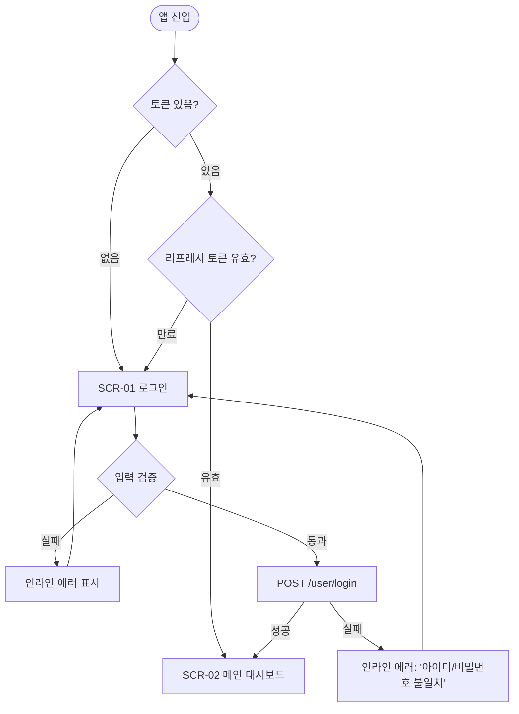
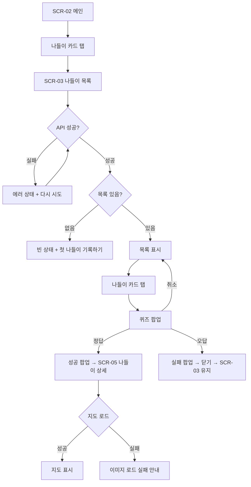
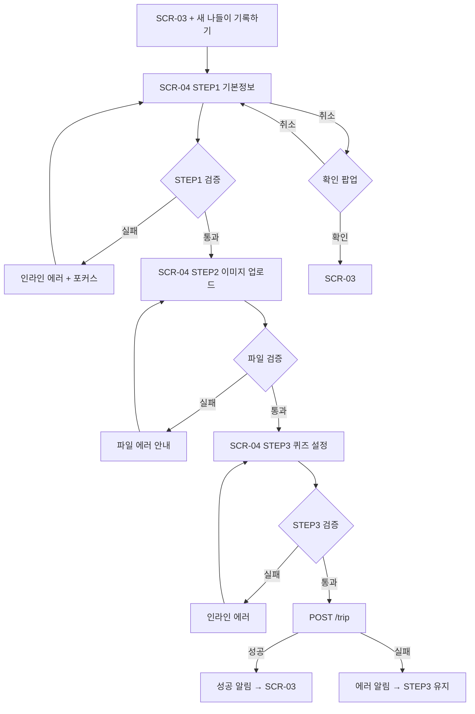
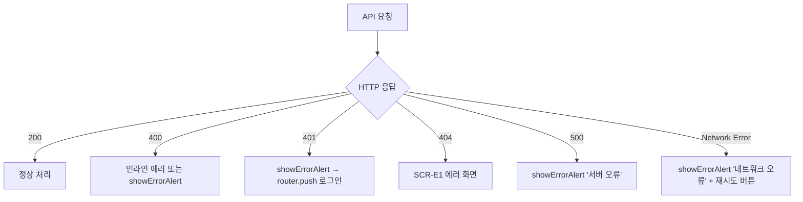

# Seoul CHONNOM (서울촌놈) — 반응형 와이어프레임 문서

> **제품명**: Seoul CHONNOM (SLCN)
> **작성 목적**: IA 기반 UI/UX 개선 와이어프레임 — 개발 구현 기준 문서
> **범위**: PC (1280px 기준) / Mobile (375px 기준)
> **기반 문서**: `docs/ia_report.md` (v2, 스크린샷 13장 분석 반영)
> **작성일**: 2026-02-26

---

## 목차

1. [가정 및 제약 사항](#1-가정-및-제약-사항)
2. [전체 레이아웃 시스템](#2-전체-레이아웃-시스템)
3. [네비게이션 & IA 매핑](#3-네비게이션--ia-매핑)
4. [화면별 와이어프레임](#4-화면별-와이어프레임)
   - [SCR-01 · /login — 로그인](#scr-01--login--로그인)
   - [SCR-02 · / — 메인 대시보드](#scr-02----메인-대시보드)
   - [SCR-03 · /map — 나들이 목록](#scr-03--map--나들이-목록)
   - [SCR-04 · /map/register — 나들이 등록](#scr-04--mapregister--나들이-등록)
   - [SCR-05 · /map/:date — 나들이 상세](#scr-05--mapdate--나들이-상세)
   - [SCR-06 · /calendar — 일정 관리](#scr-06--calendar--일정-관리)
   - [SCR-07 · /shoesRecom — 신발 추천 목록](#scr-07--shoesrecom--신발-추천-목록)
   - [SCR-08 · /:brand/:shoesName — 신발 상세](#scr-08--brandshoesname--신발-상세)
   - [SCR-E1 · 공통 에러/404 화면 (신규 제안)](#scr-e1--공통-에러404-화면-신규-제안)
5. [사용자 플로우 와이어](#5-사용자-플로우-와이어)
6. [전면 개편 옵션](#6-전면-개편-옵션)
7. [최종 체크리스트](#7-최종-체크리스트)

---

## 1. 가정 및 제약 사항

### IA에서 확인된 사실

- 전체 8개 라우트, 공개 접근 라우트는 `/login` 1개
- 모든 인증 라우트는 `admin` 역할 요구 → 사실상 2인 커플 전용 폐쇄형 서비스
- 신발 추천은 정적 데이터(API 없음), 나머지는 백엔드 API 연동
- 기존 디자인 키워드: 연분홍(`rgb(241, 214, 208)`), 손글씨 스타일, 감성적 문구

### 와이어프레임 설계 가정

| #    | 가정 내용                                                                                  |
| ---- | ------------------------------------------------------------------------------------------ |
| A-01 | 서비스 주 사용 환경은 **모바일**로 가정. (커플 데이트 기록 특성상 스마트폰 사용 빈도 높음) |
| A-02 | 디자인 시스템은 기존 연분홍 컬러 아이덴티티를 유지하되, 콘텐츠 밀도와 가독성을 개선        |
| A-03 | 공통 헤더의 SLCN 로고 클릭 시 `/` 이동 (코드 미확인, IA 기반 가정)                         |
| A-04 | 신발 추천 기능은 향후 API 전환을 고려하여 동일한 레이아웃 패턴 사용                        |
| A-05 | 퀴즈 기능은 의도된 게임화 요소로 유지하되, 오답 후 재시도 UX 개선                          |
| A-06 | 나들이 등록(`/map/register`)은 관리자 전용 기능으로, 스텝 폼으로 리팩토링                  |
| A-07 | 404 에러 화면은 현재 없으므로 신규 추가 제안                                               |

---

## 2. 전체 레이아웃 시스템

### 2.1 PC 레이아웃 (1280px 기준)

```
┌─────────────────────────────────────────────────────────────┐
│  [Global Header]  SLCN 로고(좌)    아이콘 메뉴(우)           │
│                   max-width: 960px, padding: 0 24px          │
├─────────────────────────────────────────────────────────────┤
│                                                             │
│  [Content Area]   max-width: 960px  margin: 0 auto          │
│                   padding: 32px 24px                         │
│                                                             │
│  (페이지별 콘텐츠)                                            │
│                                                             │
├─────────────────────────────────────────────────────────────┤
│  [Footer]  © Seoul CHONNOM                                   │
└─────────────────────────────────────────────────────────────┘
```

**설계 이유**

- Side Navigation을 사용하지 않는 이유: 5개 메뉴 항목은 상단 헤더에 아이콘+텍스트로 충분히 수용 가능하고, 커플 감성 앱의 가벼운 성격에 사이드 nav는 과도함
- 컨텐츠 max-width 960px: 지도 이미지, 달력 등 콘텐츠가 너무 넓으면 가독성 저하
- 12컬럼 그리드 기준이나, 카드 레이아웃은 4/4/4 또는 6/6 분할 활용

### 2.2 Mobile 레이아웃 (375px 기준)

```
┌─────────────────┐
│  [Top App Bar]  │  height: 56px, sticky
│  ← 타이틀  ···  │  좌: 뒤로가기(상세), 우: 더보기(선택)
├─────────────────┤
│                 │
│  [Content]      │  padding: 16px
│  스크롤 영역     │
│                 │
│                 │
├─────────────────┤
│  [Bottom Nav]   │  height: 60px, fixed (메인 화면만)
│  홈  지도  달력  │  신발  (Choi's)
└─────────────────┘
```

**설계 이유**

- Bottom Nav 5개 항목: 메인 진입 후 핵심 기능(나들이, 달력, 신발추천, 외부)으로 탭 전환
- 상세 페이지(SCR-05, SCR-08)에서는 Bottom Nav 숨김 → Top App Bar의 ← 버튼으로 복귀 (현재 뒤로가기 없는 문제 해결)
- 고정 CTA는 각 화면 bottom에 sticky bar 형태로 배치

### 2.3 공통 상태 UX 패턴

| 상태                  | PC 패턴                                               | Mobile 패턴 |
| --------------------- | ----------------------------------------------------- | ----------- |
| **Loading**           | 콘텐츠 영역 스켈레톤 카드 (기존 loaderComponent 활용) | 동일        |
| **Empty**             | 일러스트 + 안내 문구 + CTA 버튼 중앙 배치             | 동일        |
| **Error**             | 에러 아이콘 + 메시지 + "다시 시도" 버튼               | 동일        |
| **Permission Denied** | 잠금 아이콘 + "로그인이 필요합니다" → /login 버튼     | 동일        |

---

## 3. 네비게이션 & IA 매핑

### 메뉴 구조표

| 메뉴명          | 연결 라우트   | PC 위치               | Mobile 위치              | 노출 조건 |
| --------------- | ------------- | --------------------- | ------------------------ | --------- |
| 홈 (SLCN 로고)  | `/`           | 헤더 좌측 로고        | Top App Bar 로고         | 로그인 후 |
| 나들이 기록     | `/map`        | 헤더 우측 아이콘 메뉴 | Bottom Nav (지도 아이콘) | 로그인 후 |
| 일정 달력       | `/calendar`   | 헤더 우측 아이콘 메뉴 | Bottom Nav (달력 아이콘) | 로그인 후 |
| 신발 추천       | `/shoesRecom` | 헤더 우측 아이콘 메뉴 | Bottom Nav (신발 아이콘) | 로그인 후 |
| Choi's Film Art | 외부링크      | 헤더 우측 아이콘 메뉴 | Bottom Nav (필름 아이콘) | 로그인 후 |
| 로그인          | `/login`      | 전체 화면             | 전체 화면                | 비로그인  |

### PC 헤더 상세

```
┌─────────────────────────────────────────────────────────────────┐
│  [🏷 SLCN]          [🗺 나들이]  [📅 달력]  [👟 신발]  [🎞 필름] │
└─────────────────────────────────────────────────────────────────┘
   ↑ 클릭 → /          각 아이콘 + 텍스트 레이블, 현재 페이지 활성 표시
```

### Mobile Bottom Nav 상세

```
┌──────┬──────┬──────┬──────┬──────┐
│  🏠  │  🗺  │  📅  │  👟  │  🎞  │
│  홈  │나들이│ 달력 │ 신발 │ 필름 │
└──────┴──────┴──────┴──────┴──────┘
  현재 탭 활성 색상 강조 (연분홍→진핑크 또는 포인트 컬러)
```

---

## 4. 화면별 와이어프레임

---

### SCR-01 · `/login` — 로그인

**목적(Goal)**: 아이디/비밀번호 입력으로 인증하여 서비스에 진입한다

**주요 사용자 시나리오**

- 최초 앱 접속 시 자동으로 이 화면으로 이동
- 세션 만료 후 다시 로그인
- 리프레시 토큰 유효 시 자동 로그인 후 메인 이동

**필수 데이터**: `POST /user/login`, `GET /user/token` (silent)

---

#### 3.1 PC Wireframe — SCR-01

```
┌─────────────────────────────────────────────────────────────────┐
│                      (연분홍 배경 전체)                            │
│                                                                 │
│              ┌──────────────────────────┐                       │
│              │   [SLCN 로고 이미지]       │                       │
│              │   @Seoul CHONNOM         │                       │
│              │                          │                       │
│              │  아이디                   │                       │
│              │  ┌────────────────────┐  │                       │
│              │  │ 아이디를 입력하세요  │  │                       │
│              │  └────────────────────┘  │                       │
│              │                          │                       │
│              │  비밀번호                 │                       │
│              │  ┌────────────────────┐  │                       │
│              │  │ 비밀번호를 입력하세요│  │                       │
│              │  └────────────────────┘  │                       │
│              │                          │                       │
│              │  ┌────────────────────┐  │                       │
│              │  │      로그인         │  │  ← Primary CTA        │
│              │  └────────────────────┘  │                       │
│              │                          │                       │
│              │   © Seoul CHONNOM        │                       │
│              └──────────────────────────┘                       │
│                   카드 너비: 420px                                │
└─────────────────────────────────────────────────────────────────┘
```

**컴포넌트 목록**

| 컴포넌트      | 구분        | 비고                          |
| ------------- | ----------- | ----------------------------- |
| LoginCard     | 페이지 전용 | 흰 카드, 그림자               |
| TextInput     | 공통        | label + input + error message |
| PrimaryButton | 공통        | 로그인, 전체 너비             |

**상태 UX**

```
[로딩 중]
  로그인 버튼: "로그인 중..." + 스피너, disabled
  입력 필드: disabled

[에러]
  입력 필드 하단에 인라인 에러 메시지 (빨간 텍스트)
  예: "아이디 또는 비밀번호가 올바르지 않습니다."
  ※ 현재처럼 SweetAlert 팝업 대신 인라인으로 개선 권장

[자동 로그인 중 (리프레시)]
  전체 화면 로딩 오버레이 (반투명 + 스피너)
  → 성공 시 / 로 이동, 실패 시 로그인 폼 표시
```

---

#### 3.2 Mobile Wireframe — SCR-01

```
┌─────────────────┐
│  (연분홍 배경)   │
│                 │
│                 │
│   [SLCN 로고]   │
│  @SeoulCHONNOM  │
│                 │
│  아이디          │
│  ┌───────────┐  │
│  │아이디 입력  │  │
│  └───────────┘  │
│                 │
│  비밀번호        │
│  ┌───────────┐  │
│  │비밀번호 입력│  │
│  └───────────┘  │
│                 │
│  ┌───────────┐  │
│  │   로그인   │  │
│  └───────────┘  │
│                 │
│  © Seoul CHONNOM│
└─────────────────┘
```

**모바일 특이사항**

- 카드 없이 전체 화면 폼 배치 (여백 padding: 32px 24px)
- 비밀번호 필드에 표시/숨기기 토글 아이콘 (`👁`)
- 키보드 올라올 때 로그인 버튼이 키보드 위에 고정되도록 `position: sticky; bottom: 16px`

---

#### 3.3 행동/전환 설계 — SCR-01

| 액션                             | 결과                                                             |
| -------------------------------- | ---------------------------------------------------------------- |
| 로그인 버튼 클릭 (필드 비어있음) | 인라인 에러: "아이디를 입력해주세요" / "비밀번호를 입력해주세요" |
| 로그인 버튼 클릭 (입력 완료)     | 버튼 disabled + 스피너 → 성공: `/` 이동 → 실패: 인라인 에러      |
| Enter 키                         | 폼 제출 (마지막 필드에서)                                        |
| 페이지 진입 (리프레시 토큰 있음) | silent 로그인 시도 → 성공: `/` 자동 이동                         |

---

#### 3.4 접근성/반응형 주의사항 — SCR-01

- `<label for="username">` 연결 필수 (현재 미연결)
- placeholder를 label 대체로 사용하지 말 것 → 별도 label 표시
- 에러 메시지에 `role="alert"` 추가
- 비밀번호 필드 `autocomplete="current-password"` 설정

---

### SCR-02 · `/` — 메인 대시보드

**목적(Goal)**: 서비스의 핵심 기능으로 빠르게 진입하고 현재 D-day를 확인한다

**주요 사용자 시나리오**

- 로그인 직후 랜딩 화면으로 어디로 갈지 선택
- D-day 카드 탭으로 기념 메시지 확인
- 나들이/달력/신발 기능으로 1-2탭만에 진입

**필수 데이터**: D-day 계산 (하드코딩 `2024-11-10`, 개선 시 환경변수)

---

#### 3.1 PC Wireframe — SCR-02

```
┌─────────────────────────────────────────────────────────────────────┐
│  [🏷 SLCN]    [🗺 나들이]  [📅 달력]  [👟 신발]  [🎞 필름]          │
├─────────────────────────────────────────────────────────────────────┤
│                          (연분홍 배경)                                │
│  ┌──────────────────────────────────────────────────────────────┐   │
│  │                    ← max-width 960px →                       │   │
│  │                                                              │   │
│  │  ┌────────────────┐  ┌────────────────┐  ┌────────────────┐ │   │
│  │  │   💕 D-day     │  │   📅 일정 달력  │  │  👟 신발 추천  │ │   │
│  │  │                │  │                │  │               │ │   │
│  │  │  만난 지        │  │  이번 달 일정   │  │  오늘의 신발   │ │   │
│  │  │  ★ 474일 ★    │  │  N개           │  │  추천 보기 →  │ │   │
│  │  │                │  │                │  │               │ │   │
│  │  │  [탭하면 메시지]│  │  [달력 바로가기]│  │  [추천 보기]  │ │   │
│  │  └────────────────┘  └────────────────┘  └────────────────┘ │   │
│  │         col-4                col-4               col-4       │   │
│  │                                                              │   │
│  │  ┌─────────────────────────────────────────────────────────┐ │   │
│  │  │              🗺 나들이 기록                               │ │   │
│  │  │                                                         │ │   │
│  │  │   [최근 나들이 썸네일 3개 가로 나열]                       │ │   │
│  │  │   [부암동] [강북] [파주] ...                               │ │   │
│  │  │                                          전체 보기 →     │ │   │
│  │  └─────────────────────────────────────────────────────────┘ │   │
│  │                  col-12 (full width)                          │   │
│  │                                                              │   │
│  │  ┌───────────────────────────────┐                           │   │
│  │  │   🎞 Choi's Film Art          │                           │   │
│  │  │   네이버 카페 바로가기 →        │                           │   │
│  │  └───────────────────────────────┘                           │   │
│  │           col-6                                              │   │
│  └──────────────────────────────────────────────────────────────┘   │
└─────────────────────────────────────────────────────────────────────┘
```

**컴포넌트 목록**

| 컴포넌트         | 구분   | 비고                               |
| ---------------- | ------ | ---------------------------------- |
| DdayCard         | 도메인 | 클릭 시 SweetAlert 팝업 유지       |
| QuickNavCard     | 공통   | 아이콘 + 제목 + 부제 + 화살표      |
| TripPreviewStrip | 도메인 | 최근 3개 나들이 썸네일 가로 스크롤 |
| ExternalLinkCard | 도메인 | 외부 링크 카드                     |

**개선 포인트 (기존 대비)**

- 기존: 모든 카드가 동일한 연분홍 + 텍스트만 → 개선: 카드마다 아이콘/미리보기 콘텐츠 포함
- 나들이 카드에 최근 3개 썸네일 → 콘텐츠가 있다는 것을 직관적으로 인지

---

#### 3.2 Mobile Wireframe — SCR-02

```
┌─────────────────┐
│[🏷SLCN]      ···│  ← Top App Bar (sticky)
├─────────────────┤
│  (연분홍 배경)   │
│                 │
│  ┌─────────────┐│
│  │  💕 D-day   ││  ← 전체 너비 카드
│  │  만난 지     ││
│  │  ★ 474일 ★  ││
│  └─────────────┘│
│                 │
│  ┌────┐ ┌─────┐ │
│  │📅  │ │ 👟  │ │  ← 2열 카드
│  │달력│ │신발 │ │
│  │N개 │ │추천 │ │
│  └────┘ └─────┘ │
│                 │
│  ┌─────────────┐│
│  │ 🗺 나들이   ││  ← 전체 너비 카드
│  │[썸네일 스크롤]││  (가로 스크롤)
│  │            →││
│  └─────────────┘│
│                 │
│  ┌─────────────┐│
│  │🎞 Choi's   ││
│  │Film Art →  ││
│  └─────────────┘│
│                 │
├─────────────────┤
│ 🏠  🗺  📅  👟  🎞│  ← Bottom Nav (fixed)
└─────────────────┘
```

---

#### 3.3 행동/전환 설계 — SCR-02

| 액션                         | 결과                        |
| ---------------------------- | --------------------------- |
| D-day 카드 탭                | SweetAlert "사랑해 💕" 팝업 |
| 달력 카드 탭                 | `/calendar` 이동            |
| 신발 카드 탭                 | `/shoesRecom` 이동          |
| 나들이 카드 / "전체 보기" 탭 | `/map` 이동                 |
| Choi's Film Art 탭           | 외부 링크 새 탭 열기        |
| 나들이 썸네일 개별 탭        | 퀴즈 → 정답 시 `/map/:date` |

---

### SCR-03 · `/map` — 나들이 목록

**목적(Goal)**: 저장된 나들이 목록을 확인하고 퀴즈를 통해 나들이 상세로 진입한다

**주요 사용자 시나리오**

- 나들이 목록을 스크롤하며 추억 회상
- 특정 나들이 카드 탭 → 퀴즈 → 정답 → 지도/드라이브 확인
- 새 나들이 기록 추가 (관리자)

**필수 데이터**: `GET /trip`, `GET /depot?path=` (로고 이미지)

---

#### 3.1 PC Wireframe — SCR-03

```
┌─────────────────────────────────────────────────────────────────────┐
│  [Global Header]                                                     │
├─────────────────────────────────────────────────────────────────────┤
│  max-width 960px                                                     │
│                                                                     │
│  서울 촌놈 나들이 기록 📸            [+ 새 나들이 기록하기]  ← Primary CTA │
│  ─────────────────────────────────────────────────────────          │
│                                                                     │
│  ┌──────────────────────────────────────────────────────────┐       │
│  │ [로고]  2024.09.29 · 부암동 나들이               [→]     │       │
│  └──────────────────────────────────────────────────────────┘       │
│  ┌──────────────────────────────────────────────────────────┐       │
│  │ [로고]  2024.10.12 · 강북 나들이                 [→]     │       │
│  └──────────────────────────────────────────────────────────┘       │
│  ┌──────────────────────────────────────────────────────────┐       │
│  │ [로고]  2024.11.03 · 파주 북소리 나들이           [→]     │       │
│  └──────────────────────────────────────────────────────────┘       │
│  ...                                                                │
│                                                                     │
│  ─────────────────────────────────────────────────────────          │
│  서울 촌놈 나들이는 계속 될 예정....🤑                                 │
│                                                                     │
└─────────────────────────────────────────────────────────────────────┘
```

**[빈 상태]**

```
│                                                                     │
│              🗺                                                      │
│         아직 나들이 기록이 없어요                                       │
│      첫 나들이를 기록하고 추억을 남겨보세요!                               │
│                                                                     │
│              [+ 첫 나들이 기록하기]                                    │
│                                                                     │
```

**[로딩 상태]**

```
│  ┌──────────────────────────────────────────────────────────┐       │
│  │ [████]  ████████████████████████████████         [  ]   │       │
│  └──────────────────────────────────────────────────────────┘       │
│  ┌──────────────────────────────────────────────────────────┐       │
│  │ [████]  ████████████████████████████████         [  ]   │       │
│  └──────────────────────────────────────────────────────────┘       │
│  (스켈레톤 3개)                                                        │
```

**[에러 상태]**

```
│              ⚠️                                                      │
│       목록을 불러오지 못했어요                                           │
│       네트워크를 확인하고 다시 시도해주세요                                 │
│                                                                     │
│              [다시 시도]                                               │
```

---

#### 3.2 Mobile Wireframe — SCR-03

```
┌─────────────────┐
│← 나들이 기록 📸  │  ← Top App Bar
├─────────────────┤
│                 │
│ ┌─────────────┐ │
│ │[로고] 날짜   │ │  ← 카드 탭 → 퀴즈 팝업
│ │      이름  →│ │
│ └─────────────┘ │
│ ┌─────────────┐ │
│ │[로고] 날짜   │ │
│ │      이름  →│ │
│ └─────────────┘ │
│ ...             │
│                 │
│ 나들이는 계속될  │
│ 예정....🤑      │
│                 │
├─────────────────┤
│[+ 새 나들이 기록]│  ← Sticky Bottom CTA (관리자만 노출)
├─────────────────┤
│ 🏠  🗺  📅  👟  🎞│
└─────────────────┘
```

**퀴즈 팝업 (개선)**

```
┌─────────────────┐
│  ?              │
│  등산 이후       │
│  들렀던 카페는?  │
│  ─────────────  │
│  ○ 백화일        │  ← 라디오 버튼
│  ○ 신오름이      │
│  ○ 알스키친      │
│  ○ 생마차        │
│  ─────────────  │
│ [취소]  [확인]   │  ← 취소 버튼 추가 (개선)
└─────────────────┘
```

---

#### 3.3 행동/전환 설계 — SCR-03

| 액션                      | 결과                                       |
| ------------------------- | ------------------------------------------ |
| 나들이 카드 클릭          | 퀴즈 팝업 표시                             |
| 퀴즈 정답 선택 + 확인     | 성공 팝업 → 자동 닫힘 → `/map/:date` 이동  |
| 퀴즈 오답 선택 + 확인     | 실패 팝업 → 닫기 → 목록 잔류 (재시도 가능) |
| 퀴즈 취소                 | 팝업 닫힘, 목록 잔류                       |
| "새 나들이 기록하기" 클릭 | `/map/register` 이동                       |
| "다시 시도" 클릭 (에러)   | `getTripList()` 재호출                     |

---

### SCR-04 · `/map/register` — 나들이 등록

**목적(Goal)**: 나들이 기본정보·지도·퀴즈를 단계적으로 입력하여 새 나들이 기록을 등록한다

**주요 사용자 시나리오**

- 나들이 다녀온 날 기록 추가 (관리자)
- 지도 이미지 1~2장, 로고, 드라이브 링크, 퀴즈 설정

**필수 데이터**: `POST /trip` (multipart/form-data)

**가정**: 스텝 폼 3단계로 리팩토링 — [기본정보] → [이미지 업로드] → [퀴즈 설정]

---

#### 3.1 PC Wireframe — SCR-04 (스텝 폼)

```
┌─────────────────────────────────────────────────────────────────────┐
│  [Global Header]                                                     │
├─────────────────────────────────────────────────────────────────────┤
│  서울 촌놈 나들이 추가                                                  │
│                                                                     │
│  ●────────────●────────────○                                        │
│  기본 정보    이미지 업로드   퀴즈 설정                                   │
│  (STEP 1/3)                                                         │
│  ─────────────────────────────────                                  │
│                                                                     │
│  [STEP 1: 기본 정보]                                                  │
│                                                                     │
│  나들이 유형 *                                                         │
│  (●) 아영  ( ) 일권                                                   │
│                                                                     │
│  날짜 *                                                              │
│  ┌──────────────────┐                                               │
│  │  2024-09-29      │  [📅]                                         │
│  └──────────────────┘                                               │
│                                                                     │
│  나들이 이름 *                                                         │
│  ┌──────────────────────────────────────────┐                       │
│  │  예: 부암동 나들이                          │                       │
│  └──────────────────────────────────────────┘                       │
│                                                                     │
│  드라이브 링크 *                                                        │
│  ┌──────────────────────────────────────────┐                       │
│  │  https://...                             │                       │
│  └──────────────────────────────────────────┘                       │
│                                                                     │
│                              [취소]  [다음 →]                         │
└─────────────────────────────────────────────────────────────────────┘
```

**[STEP 2: 이미지 업로드]**

```
│  ●────────────●────────────○                                        │
│  기본 정보    이미지 업로드   퀴즈 설정                                   │
│  ─────────────────────────────────                                  │
│                                                                     │
│  나들이 로고 *                                                         │
│  ┌──────────────────┐                                               │
│  │                  │  ← 드래그&드롭 또는 클릭 업로드                   │
│  │   📎 파일 선택    │  jpg, png, gif, svg / 최대 10MB                │
│  │                  │                                               │
│  └──────────────────┘                                               │
│  [미리보기 썸네일이 여기에]                                               │
│                                                                     │
│  나들이 지도 1 *                                                       │
│  ┌──────────────────┐                                               │
│  │   📎 파일 선택    │                                               │
│  └──────────────────┘                                               │
│                                                                     │
│  [ ] 지도 2장 추가하기 (선택)                                            │
│  ↓ 체크 시 확장                                                        │
│  ┌────────────────────────┐  지도 1 버튼 이름: [______]               │
│  │   📎 파일 선택 (지도2)  │  지도 2 버튼 이름: [______]               │
│  └────────────────────────┘                                         │
│                                                                     │
│                           [← 이전]  [다음 →]                          │
```

**[STEP 3: 퀴즈 설정]**

```
│  ●────────────●────────────●                                        │
│  기본 정보    이미지 업로드   퀴즈 설정                                   │
│  ─────────────────────────────────                                  │
│                                                                     │
│  퀴즈 제목 *                                                           │
│  ┌──────────────────────────────────────────┐                       │
│  │  예: 등산 이후 들렀던 카페의 이름은?         │                       │
│  └──────────────────────────────────────────┘                       │
│                                                                     │
│  선택지 (4개) *                                                        │
│  ┌───────────────────┐  ┌───────────────────┐                       │
│  │ 선택지 1: [______] │  │ 선택지 2: [______] │                       │
│  └───────────────────┘  └───────────────────┘                       │
│  ┌───────────────────┐  ┌───────────────────┐                       │
│  │ 선택지 3: [______] │  │ 선택지 4: [______] │                       │
│  └───────────────────┘  └───────────────────┘                       │
│                                                                     │
│  정답 *                                                              │
│  (●) 선택지 1  ( ) 선택지 2  ( ) 선택지 3  ( ) 선택지 4              │
│                                                                     │
│  정답 메시지 *          │  오답 메시지 *                                 │
│  제목: [____________]  │  제목: [____________]                        │
│  내용: [____________]  │  내용: [____________]                        │
│                                                                     │
│                           [← 이전]  [✓ 등록하기]                       │
```

---

#### 3.2 Mobile Wireframe — SCR-04

```
┌─────────────────┐
│← 나들이 추가    │
├─────────────────┤
│ ●──●──○         │  스텝 인디케이터
│ 1  2  3         │
├─────────────────┤
│                 │
│ [STEP 1]        │
│                 │
│ 나들이 유형 *   │
│ (●)아영 (○)일권 │
│                 │
│ 날짜 *          │
│ ┌─────────────┐ │
│ │2024-09-29 📅│ │
│ └─────────────┘ │
│                 │
│ 나들이 이름 *   │
│ ┌─────────────┐ │
│ │부암동 나들이 │ │
│ └─────────────┘ │
│                 │
│ 드라이브 링크 * │
│ ┌─────────────┐ │
│ │https://...  │ │
│ └─────────────┘ │
│                 │
├─────────────────┤
│[취소]  [다음 →] │  ← Sticky Bottom Bar
└─────────────────┘
```

---

#### 3.3 행동/전환 설계 — SCR-04

| 액션                     | 결과                                                        |
| ------------------------ | ----------------------------------------------------------- |
| "다음" (STEP1)           | 현재 스텝 필드 검증 → 통과 시 STEP2                         |
| "다음" (STEP2)           | 파일 검증 → 통과 시 STEP3                                   |
| "등록하기" (STEP3)       | 전체 검증 → `POST /trip` → 성공: `/map` / 실패: 인라인 에러 |
| "← 이전"                 | 이전 스텝으로 (입력값 유지)                                 |
| "취소"                   | 확인 팝업("작성 중인 내용이 사라집니다") → 확인 시 `/map`   |
| 필수 필드 누락 시 "다음" | 해당 필드 인라인 에러 + 포커스 이동                         |

---

### SCR-05 · `/map/:date` — 나들이 상세

**목적(Goal)**: 퀴즈를 통과한 특정 나들이의 지도와 드라이브 링크를 확인한다

**주요 사용자 시나리오**

- 지도 이미지 확인 및 드라이브 앨범으로 이동
- 복수 지도 시 지도 1↔2 전환

**필수 데이터**: `GET /trip/:date`, `GET /depot?path=`

---

#### 3.1 PC Wireframe — SCR-05

```
┌─────────────────────────────────────────────────────────────────────┐
│  [Global Header]                                                     │
├─────────────────────────────────────────────────────────────────────┤
│                                                                     │
│  ← 나들이 목록    서울 촌놈 나들이 경로 😎                               │
│  ─────────────────────────────────────────────────────────          │
│                                                                     │
│  ┌──────────────────────────────────────────────────────────┐       │
│  │                                                          │       │
│  │              [지도 이미지]                                │       │
│  │              max-height: 600px                           │       │
│  │              object-fit: contain                         │       │
│  │                                                          │       │
│  └──────────────────────────────────────────────────────────┘       │
│                                                                     │
│  복수 지도인 경우:                                                      │
│  ○ 지도 1 (부암동 경로)   ● 지도 2 (파주 경로)   ← 탭 또는 세그먼트 컨트롤  │
│                                                                     │
│  ┌──────────────────────────────────────────────┐                   │
│  │  📷 드라이브에서 사진 보기                      │  ← Secondary CTA  │
│  └──────────────────────────────────────────────┘                   │
│                                                                     │
└─────────────────────────────────────────────────────────────────────┘
```

**[로딩 상태]**

```
│  ┌──────────────────────────────────────────────────────────┐       │
│  │          ████████████████████████████████████           │       │
│  │          ████████ (스켈레톤 이미지 플레이스홀더)  ████████  │       │
│  │          ████████████████████████████████████████████████│       │
│  └──────────────────────────────────────────────────────────┘       │
```

---

#### 3.2 Mobile Wireframe — SCR-05

```
┌─────────────────┐
│← 나들이 경로 😎 │  ← Top App Bar (sticky)
├─────────────────┤
│                 │
│  ┌───────────┐  │  지도 전환 탭 (복수 지도만)
│  │부암동 │파주│  │  ← 세그먼트 컨트롤
│  └───────────┘  │
│                 │
│ ┌─────────────┐ │
│ │             │ │
│ │  [지도 이미지│ │  width: 100%, height: auto
│ │   전체 너비] │ │
│ │             │ │
│ └─────────────┘ │
│                 │
├─────────────────┤
│[📷 드라이브 보기]│  ← Sticky Bottom CTA
├─────────────────┤
│ 🏠  🗺  📅  👟  🎞│
└─────────────────┘
```

---

#### 3.3 행동/전환 설계 — SCR-05

| 액션                 | 결과                                  |
| -------------------- | ------------------------------------- |
| "← 나들이 목록" 클릭 | `/map` 이동 (뒤로가기 개선)           |
| 지도 탭 전환         | `isMap1` 토글 → 해당 지도 이미지 표시 |
| "드라이브 보기" 클릭 | 드라이브 링크 새 탭 열기              |

---

### SCR-06 · `/calendar` — 일정 관리

**목적(Goal)**: 월간 달력에서 두 사람의 일정을 생성·수정·삭제한다

**주요 사용자 시나리오**

- 이번 달 일정 확인
- 새 일정 추가 (날짜 클릭 → 팝업)
- 달 이동으로 지난달/다음 달 일정 확인

**필수 데이터**: `GET /schedule`, `GET /schedule/date?year=&month=`, CRUD API

---

#### 3.1 PC Wireframe — SCR-06

```
┌─────────────────────────────────────────────────────────────────────┐
│  [Global Header]                                                     │
├─────────────────────────────────────────────────────────────────────┤
│                                                                     │
│  서울촌놈 나들이 일정 📅                                                 │
│  ─────────────────────────────────────                               │
│                                                                     │
│  [◀ 이전달]   2026년 2월   [다음달 ▶]   [오늘]                          │
│                                                                     │
│  ┌──────────────────────────────────────────────────────────┐       │
│  │  일   월   화   수   목   금   토                           │       │
│  ├──────────────────────────────────────────────────────────┤       │
│  │  1    2    3    4    5    6    7                           │       │
│  │  8    9   10   11   12   13   14                          │       │
│  │ 15   16   17   18   19   20   21                          │       │
│  │ 22   23   24   25  [26]  27   28                          │       │
│  │                   ↑오늘                                   │       │
│  └──────────────────────────────────────────────────────────┘       │
│  TOAST UI Calendar 사용 (locale: ko 설정)                             │
│                                                                     │
│  범례: ● ayo  ● rik                                                  │
│                                                                     │
└─────────────────────────────────────────────────────────────────────┘
```

**[빈 상태 — 일정 없는 달]**

```
│  ┌──────────────────────────────────────────────────────────┐       │
│  │  (빈 달력 그리드)                                          │       │
│  └──────────────────────────────────────────────────────────┘       │
│                                                                     │
│  📅 이번 달 일정이 없어요                                               │
│     날짜를 클릭해서 일정을 추가해보세요                                    │
```

---

#### 3.2 Mobile Wireframe — SCR-06

```
┌─────────────────┐
│← 나들이 일정 📅 │
├─────────────────┤
│◀  2026년 2월  ▶│  ← 달 이동 컨트롤
│           [오늘]│
├─────────────────┤
│일 월 화 수 목 금 토│
│ 1  2  3  4  5  6  7│
│ 8  9 10 11 12 13 14│
│15 16 17 18 19 20 21│
│22 23 24 25[26]27 28│
├─────────────────┤
│● ayo  ● rik     │  범례
├─────────────────┤
│ 🏠  🗺  📅  👟  🎞│
└─────────────────┘
```

---

#### 3.3 행동/전환 설계 — SCR-06

| 액션                | 결과                                       |
| ------------------- | ------------------------------------------ |
| ◀/▶ 버튼            | `moveMonth()` → `GET /schedule/date`       |
| 오늘 버튼           | `moveMonth(0)` → 오늘 날짜 달로 이동       |
| 날짜 빈 영역 클릭   | TOAST UI 일정 생성 팝업                    |
| 이벤트 클릭         | TOAST UI 상세/수정/삭제 팝업               |
| 일정 생성 실패      | `showErrorAlert(error.message)`            |
| 일정 수정/삭제 실패 | `showErrorAlert()` 추가 (현재 없음 → 개선) |

---

### SCR-07 · `/shoesRecom` — 신발 추천 목록

**목적(Goal)**: 브랜드별 신발 카탈로그를 보고 관심 신발을 선택하여 상세 정보를 확인한다

**주요 사용자 시나리오**

- 브랜드별 신발 목록 스크롤
- 특정 신발 클릭 → 상세 정보 확인

**필수 데이터**: `global.js` 정적 데이터 (뉴발란스 2, 나이키 3, 아식스 1)

---

#### 3.1 PC Wireframe — SCR-07

```
┌─────────────────────────────────────────────────────────────────────┐
│  [Global Header]                                                     │
├─────────────────────────────────────────────────────────────────────┤
│                                                                     │
│  서울 촌놈의 신발 추천 👟                                               │
│  ─────────────────────────────────────                               │
│                                                                     │
│  ── 뉴발란스 ────────────────────────────────────────────────────    │
│  [NB 로고]  발 편한건 역시 뉴발란스지~                                   │
│                                                                     │
│  ┌──────────────┐  ┌──────────────┐                                  │
│  │  [NB574 이미지]│  │[NB530 이미지] │                                  │
│  │  뉴발란스 574 │  │ 뉴발란스 530  │                                  │
│  │  149,000원   │  │ 129,000원    │                                  │
│  │  자세히 보기→ │  │ 자세히 보기→  │                                  │
│  └──────────────┘  └──────────────┘                                  │
│            col-4          col-4                                      │
│                                                                     │
│  ── 나이키 ─────────────────────────────────────────────────────    │
│  [NIKE 로고]  설명...                                                  │
│                                                                     │
│  ┌──────────────┐  ┌──────────────┐  ┌──────────────┐               │
│  │  [P-6000]   │  │   [V2K런]    │  │  [줌보메로5]  │               │
│  │  129,000원  │  │  129,000원   │  │  189,000원   │               │
│  │  자세히 →   │  │  자세히 →    │  │   자세히 →   │               │
│  └──────────────┘  └──────────────┘  └──────────────┘               │
│                                                                     │
│  ── 아식스 ─────────────────────────────────────────────────────    │
│  ...                                                                │
└─────────────────────────────────────────────────────────────────────┘
```

---

#### 3.2 Mobile Wireframe — SCR-07

```
┌─────────────────┐
│← 신발 추천 👟   │
├─────────────────┤
│                 │
│ ─ 뉴발란스 ──── │
│ [NB로고] 설명   │
│                 │
│ ┌────┐  ┌────┐  │  ← 2열 그리드
│ │NB  │  │NB  │  │
│ │574 │  │530 │  │
│ │14만│  │12만│  │
│ └────┘  └────┘  │
│                 │
│ ─ 나이키 ─────  │
│ ...             │
│                 │
│ ─ 아식스 ─────  │
│ ┌────┐          │  ← 1개면 좌측 정렬
│ │조그 │          │
│ │100 │          │
│ └────┘          │
│                 │
├─────────────────┤
│ 🏠  🗺  📅  👟  🎞│
└─────────────────┘
```

---

#### 3.3 행동/전환 설계 — SCR-07

| 액션           | 결과                                                                  |
| -------------- | --------------------------------------------------------------------- |
| 신발 카드 클릭 | `/:brand/:shoesName` 이동                                             |
| 카드 호버 (PC) | 카드 살짝 올라오는 효과 + 그림자 강조 (기존 NavigationCard 패턴 활용) |

---

### SCR-08 · `/:brand/:shoesName` — 신발 상세

**목적(Goal)**: 선택한 신발의 상세 정보(설명·착용샷·영상)를 확인한다

**주요 사용자 시나리오**

- 신발 사진과 설명 확인
- 착용 리뷰 이미지 및 인스타그램 링크 확인
- 유튜브 리뷰 영상 시청 (영상 있는 신발)

**필수 데이터**: `global.js` 정적 데이터

---

#### 3.1 PC Wireframe — SCR-08

```
┌─────────────────────────────────────────────────────────────────────┐
│  [Global Header]                                                     │
├─────────────────────────────────────────────────────────────────────┤
│                                                                     │
│  ← 신발 추천 목록    서울 촌놈의 신발 추천 👟                             │
│  ─────────────────────────────────────                               │
│                                                                     │
│  ┌───────────────────────┐  ┌───────────────────────────────────┐   │
│  │                       │  │  뉴발란스 530                      │   │
│  │   [신발 이미지]        │  │  동글동글 괜찮잖아.                 │   │
│  │   (정방형, 400x400)    │  │                                   │   │
│  │                       │  │  설명 1 ──────────────────────    │   │
│  │                       │  │  설명 2 ──────────────────────    │   │
│  │                       │  │  설명 3 ──────────────────────    │   │
│  │                       │  │  설명 4 ──────────────────────    │   │
│  └───────────────────────┘  └───────────────────────────────────┘   │
│         col-5                           col-7                        │
│                                                                     │
│  [유튜브 영상] (영상 있는 신발만)                                         │
│  ┌──────────────────────────────────────────────────────────┐       │
│  │  (16:9 iframe embed)                                     │       │
│  └──────────────────────────────────────────────────────────┘       │
│                                                                     │
│  ── 착용 샷 ──────────────────────────────────────────────────      │
│  ┌──────────────────────────┐  ┌──────────────────────────┐         │
│  │  [리뷰 이미지 1]          │  │  [리뷰 이미지 2]           │         │
│  │  설명 텍스트              │  │  설명 텍스트               │         │
│  │  [인스타그램 보기 ↗]       │  │  [인스타그램 보기 ↗]        │         │
│  └──────────────────────────┘  └──────────────────────────┘         │
│                                                                     │
└─────────────────────────────────────────────────────────────────────┘
```

---

#### 3.2 Mobile Wireframe — SCR-08

```
┌─────────────────┐
│← 신발 추천     │
├─────────────────┤
│                 │
│ ┌─────────────┐ │
│ │  [신발 이미지]│ │  ← 정방형, 전체 너비
│ └─────────────┘ │
│                 │
│ 뉴발란스 530    │
│ 동글동글 괜찮잖아│
│                 │
│ 설명 1 ───────  │
│ 설명 2 ───────  │
│ 설명 3 ───────  │
│ 설명 4 ───────  │
│                 │
│ (영상 있을 경우) │
│ ┌─────────────┐ │
│ │ [유튜브 16:9]│ │
│ └─────────────┘ │
│                 │
│ ── 착용 샷 ──── │
│ ┌─────────────┐ │
│ │ [리뷰이미지1]│ │
│ │ 설명         │ │
│ │[인스타 보기↗]│ │
│ └─────────────┘ │
│ ┌─────────────┐ │
│ │ [리뷰이미지2]│ │
│ └─────────────┘ │
│                 │
├─────────────────┤
│ 🏠  🗺  📅  👟  🎞│
└─────────────────┘
```

---

#### 3.3 행동/전환 설계 — SCR-08

| 액션                             | 결과                                                 |
| -------------------------------- | ---------------------------------------------------- |
| "← 신발 추천" 클릭               | `/shoesRecom` 이동 (뒤로가기 개선)                   |
| "인스타그램 보기" 클릭           | 외부 링크 새 탭 열기 (`windowOpen`)                  |
| 잘못된 URL 접근 (`/nb/없는신발`) | "존재하지 않는 신발입니다" 안내 + `/shoesRecom` 버튼 |

---

### SCR-E1 · 공통 에러/404 화면 (신규 제안)

**목적(Goal)**: 잘못된 URL 접근 또는 서버 오류 시 사용자를 안내하고 복구 경로를 제공한다

**가정**: 현재 존재하지 않는 화면 — 신규 추가 제안

---

#### PC / Mobile Wireframe — SCR-E1

```
PC:
┌─────────────────────────────────────────────────────────────────────┐
│  [Global Header]                                                     │
├─────────────────────────────────────────────────────────────────────┤
│                                                                     │
│                    🗺                                                │
│              길을 잃었어요...                                          │
│         요청하신 페이지를 찾을 수 없어요                                  │
│                                                                     │
│              [🏠 메인으로 돌아가기]                                    │
│                                                                     │
└─────────────────────────────────────────────────────────────────────┘

Mobile:
┌─────────────────┐
│← (빈 헤더)      │
├─────────────────┤
│                 │
│       🗺        │
│   길을 잃었어요  │
│  찾을 수 없어요  │
│                 │
│ [🏠 메인으로]   │
└─────────────────┘
```

---

## 5. 사용자 플로우 와이어

### 플로우 1 — 비로그인 → 로그인 → 메인



---

### 플로우 2 — 나들이 목록 → 퀴즈 → 상세



---

### 플로우 3 — 나들이 등록 (관리자)



---

### 플로우 4 — 에러 처리 분기



---

## 6. 전면 개편 옵션

### Option A — 부분 개선안 (Incremental Improvement)

**방향**: 기존 컴포넌트/라우팅 구조 유지, UX 문제점만 수정

| 개선 항목            | 변경 범위                                        |
| -------------------- | ------------------------------------------------ |
| 뒤로가기 버튼 추가   | `tripPage.vue`, `shoesInfo.vue` 각 1줄 추가      |
| placeholder 한국어화 | `loginPage.vue` placeholder 속성 변경            |
| 달력 locale 한국어   | `calendarPage.vue` TOAST UI 옵션 `locale: 'ko'`  |
| 빈 상태 추가         | `mapPage.vue`, `calendarPage.vue` v-if 조건 추가 |
| 로딩 인디케이터      | `loaderComponent.vue` 기존 컴포넌트 활성화       |
| 등록 폼 라벨 수정    | `mapRegisterPage.vue` 텍스트 변경                |

**장점**: 개발 공수 최소 (1-2일), 즉각 효과, 기존 사용자 혼란 없음
**단점**: 근본적 디자인 개선 없음, 모바일 여전히 미흡, 카드 콘텐츠 부재 지속
**추천 대상**: 단기 개선 sprint

---

### Option B — 전면 개편안 (Full Redesign) ← **권장**

**방향**: 이 와이어프레임 문서 기준으로 PC/Mobile 분리 대응형 UI 전면 재설계

| 개선 항목                      | 변경 범위                                             |
| ------------------------------ | ----------------------------------------------------- |
| 반응형 레이아웃                | 전체 CSS 재작성 (미디어 쿼리 체계 도입)               |
| Bottom Nav (Mobile)            | `App.vue`에 BottomNav 컴포넌트 추가                   |
| 메인 대시보드 카드 콘텐츠 보강 | 5개 카드 컴포넌트 각각 리디자인                       |
| 스텝 폼                        | `mapRegisterPage.vue` 단계별 UI로 분리                |
| 디자인 시스템                  | CSS 변수 확장 (타이포그래피, 스페이싱, 컴포넌트 토큰) |
| 상태 UX 전면 적용              | 전 화면 loading/empty/error 패턴                      |

**장점**: 사용성 대폭 향상, 모바일 대응, 서비스 인상 개선, 확장성 확보
**단점**: 개발 공수 높음 (2-4주), 디자인 리소스 필요, 기존 스타일 전면 교체 필요
**추천 대상**: 전면 개편 목표 달성

**권장 이유**: 현재 문제(메인 카드 빈 콘텐츠, 모바일 미지원, 뒤로가기 없음, 로딩 없음)가 개별 수정보다 한 번에 해결하는 것이 기술 부채를 줄이는 데 효율적. 서비스 규모가 작아 전면 개편 부담도 낮음.

---

## 7. 최종 체크리스트

| 항목                                               |        완료         |
| -------------------------------------------------- | :-----------------: |
| IA의 모든 화면(8개)이 와이어프레임에 포함되었는가? |         ✅          |
| 신규 제안 화면(SCR-E1 에러/404)이 추가되었는가?    |         ✅          |
| PC / Mobile 레이아웃이 모두 존재하는가?            |         ✅          |
| 각 화면에 Loading 상태가 정의되어 있는가?          | ✅ (SCR-01, 03, 05) |
| 각 화면에 Empty 상태가 정의되어 있는가?            |   ✅ (SCR-03, 06)   |
| 각 화면에 Error 상태가 정의되어 있는가?            |     ✅ (SCR-03)     |
| CTA(Primary/Secondary)가 정의되어 있는가?          |         ✅          |
| 폼 검증/에러 문구/완료 후 이동이 명시되었는가?     |   ✅ (SCR-01, 04)   |
| "뒤로가기/취소" 규칙이 정의되어 있는가?            | ✅ (SCR-04, 05, 08) |
| 접근성 주의사항이 명시되었는가?                    |         ✅          |
| 사용자 플로우 다이어그램(Mermaid)이 포함되었는가?  |      ✅ (4개)       |
| 개편 옵션 2가지가 제시되었는가?                    |         ✅          |
| IA에 없는 내용은 "가정:"으로 표시되었는가?         |         ✅          |
